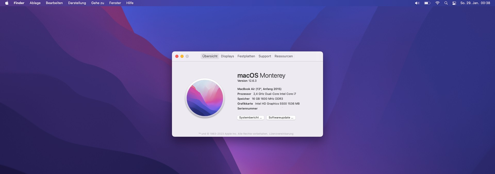

# HP Elitebook 850 G2 Hackintosh (Broadwell - 5th Gen.)

## Information
- System: MacOS Monterey 12.x
- SMBIOS: MacBookAir7,2
- Bootloader: OpenCore 0.8.8
- ToDo: Fix all In Progress Stuff | Upgrade to MacOS Ventura 13.x 
- NVRAM Reset after Install recommended
- Status: WIP

## Hardware
- Processor: Intel Core i7 5500U @2,4Ghz, Turbo@3,0Ghz, TDP: 15W
- iGPU: Intel HD Graphics 5500
- dGPU: AMD Radeon R7 M260X - 1GB Shared Memory GDDR5
- Display: FullHD 1920x1080
- RAM: 2x8GB DDR3L DualChannel SDRAM - 16GB in Total
- Audio: Realtek ALC280 
- Ethernet: Intel I218LM Gigabit Networkadaptor
- WiFi & Bluetooth: Intel Dualband Wireless AC7265 B/G/N 2,4/5Ghz
- Trackpad: MultiTouch Synaptics
- Keyboard: HP OEM Keyboard with White Backlight
- SDCard Reader: Realtek RTS5227
- Webcam: HP HD Camera
- Fingerprint Sensor: Synaptics (PID003f)
- Mobile Network: HP-ltxxx LTE/3G/2G Module 
- USB: 5x 3.0
- Misc: Wireless Buttons/FN Keys Functions

## Requirements
- min. 16GB USB Drive
- Network Connection
- Brain.exe

## Installation 
1. Prepare your UEFI
   - Load Default Settings
   - Disable VT-d (already Disabled via OpenCore Config (DisableIOMapper))
   - Enable VT-x
   - Disable Fastboot
   - Disable SecureBoot
   - Enable XHCI USB 
   - SATA Mode: AHCI
   - DVMT Pre-Allocated Memory set to 64MB or Higher

2. Download MacOS Monterey from AppStore 
3. Prepare your USB Stick
   - Format via Disk Utility your USB-Drive in GUID and MacOS(HFS)
   - Run Terminal and enter following code to Create the Installer Medium: `sudo /Applications/Install\ macOS\ Monterey.app/Contents/Resources/createinstallmedia --volume /Volumes/yourusbname` | Replace yourusbname with your created USB Drive Name
4. run via Terminal: `sudo diskutil list` then find your USB Device e.g. disk0sX (u must have 2 Partitions e.g. EFI and Install Monterey) Pick the EFI and run `sudo diskutil mount diskXsX`. Now u have mounted your EFI Partition.
5. Copy the EFI Folder to the USB Drive. The Structure must be: /drive/EFI/EFI/OCandBOOT/
6. Reboot your PC and Boot from it via F9 Key!
7. When the Installer is Booted, Goto Disk Utility > Show All Volumes > Erase your Disk as APFS and GUID
8. The System will several restarts. Keep in mind, u need every Reboot Press F9 to boot from USB or set as Default Boot Option in UEFI
9. Finish Setup Assistent
10. Copy EFI to Main Partition(proceed like in Step 4.)
11. Congrulations, ur Hackintosh is Ready!

## Downloads
> - coming soon - 

## Working
- [x] Boot
- [x] Audio (Speaker,Mic,Combo Jack)
- [x] iGPU QI/CI
- [x] Display & Brightness Control
- [x] WiFi & Bluetooth (not the best Speed - 30/40MB/s, if u dont care about Speed then its fine else if not - Replace with a Compatible Broadcom/Atheros WiFi Card)
- [x] Ethernet
- [x] 4G Modem/Module (SIM not tested but detected by MacOS)
- [x] FN-Keys Function e.g. Brightness,Audio,...
- [x] Wireless/Mute Button
- [x] Touchpad(all Trackpad functions e.g. Gestures) & Keyboard
- [x] Battery (Detected,Shows information)
- [x] All USB Ports (EHCI(2.0),XHCI(3.0))
- [x] Realtek SDCard Reader (Shown as Internal SDReader, not tested - no SDCard for it!)
- [x] SATA Controller
- [x] Memory DIMM Bank1/Bank2 Informations
- [x] Webcam
- [x] RTC/CMOS
- [x] Power Managment (50/50)
- [x] Restart/Shutdown***
- [x] NVRAM

*** = After a NVRAM Reset u need perform a Restart, to get CMOS State Fixed + Restart/Shutdown (after u get first Shutdown worked, its all fine. Hope we will find a Fix to get from Beginning working, restart seems working all time.) 

## Not Working
- [ ] dGPU (Not Compatible with MacOS), Disabled via boot-arg `-wegnoegpu`
- [ ] Fingerprint Reader (will never Works in MacOS)

## In Progress (WIP)
- Finetuning e.g. CPU Powermanagment CPUFriendDATAProvider
- Sleep/Wake
- Close/open lid cause blackscreen and need Force Power off
- Remove Charger Rebooting System